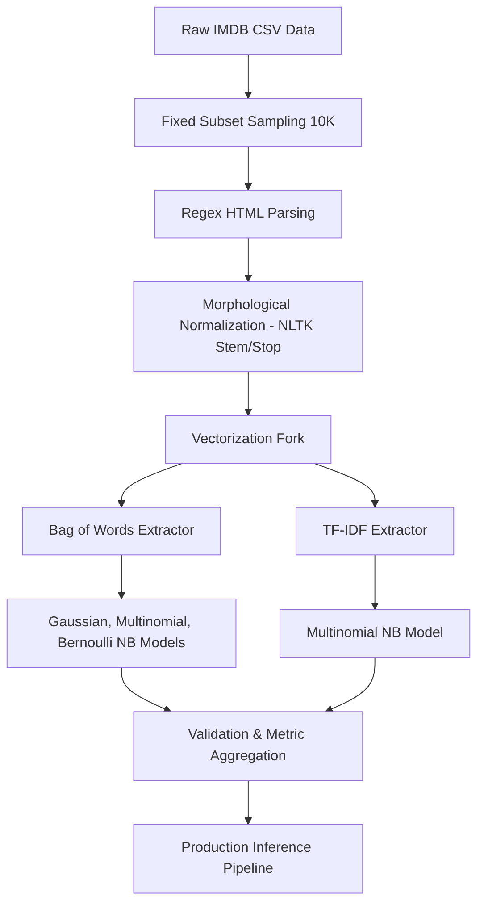

# Movie Sentiment Analysis

## 1. Cover Page

**Title:** Movie Sentiment Analysis  
**Students:**  
- Pranav Upadhyay (23FE10CSE00538)  
- Lakshay Karwa (23FE10CSE00726)  

**Faculty:** Dr. Shikha Mundra  
**Institute:** Manipal University Jaipur  
**Course:** Natural Language Processing  
**Date:** April 9, 2026  

---

## 2. Abstract

Sentiment analysis on movie reviews is a classical Natural Language Processing (NLP) problem that aims to classify textual data into polarized categories: positive or negative. This fundamental task provides deep insights into audience reception and content success. In this project, an end-to-end NLP pipeline was developed utilizing the IMDB dataset consisting of movie reviews. The raw text was systematically cleaned using techniques including HTML tag stripping, normalization, custom character filtering, stopword removal, and Porter stemming. Following data purification, two primary vectorization paradigms—Bag-of-Words (BoW) and Term Frequency-Inverse Document Frequency (TF-IDF)—were constructed to model statistical word associations. A comparative study of three Naive Bayes configurations (Gaussian, Multinomial, and Bernoulli) was conducted to evaluate performance on high-dimensional sparse representations. Our results indicate that the BernoulliNB classifier utilizing BoW features attained the highest empirical accuracy of 83.50%, slightly outperforming TF-IDF implementations. The study demonstrates the capacity of lightweight probabilistic models to yield robust text classification performance when paired with meticulous feature engineering.

---

## 3. Introduction

The explosion of user-generated content on digital platforms has necessitated automated systems capable of extracting subjective metrics from vast text corporas. Sentiment analysis, a subfield of Natural Language Processing, serves a crucial role in the industry—powering brand monitoring, product recommendation engines, and customer satisfaction pipelines. Assessing movie reviews is highly relevant because cinema evokes complex, emotive language, presenting a non-trivial classification challenge. 

Despite the advent of large language models, foundational probabilistic approaches such as Naive Bayes remain highly relevant in production environments due to their computational efficiency, interpretability, and robust performance on sparse textual data. This document outlines the structured development of a movie sentiment classification system deployed to infer binary sentiment (positive vs. negative) from unstructured review data.

---

## 4. Problem Definition

**Formal Definition:** Given a text document $d \in D$ composed of semantic vocabulary $V$, the underlying objective is to map each text sequence to a target class $c \in \{0, 1\}$, where $0$ denotes negative sentiment and $1$ denotes positive sentiment. 

**Input:** Unstructured natural language movie reviews of arbitrary length.  
**Output:** A binary classification label (Positive / Negative) with an associated probabilistic certainty.  
**Classification Type:** Supervised Binary Text Classification.

---

## 5. Objectives

**Technical Goals:**
- Ingest, parse, and clean chaotic, web-scraped natural language text.
- Engineer statistically significant numerical features from textual sequences using discrete vector representations.
- Train and evaluate computationally lightweight Naive Bayes classifiers to establish a robust classification baseline.

**Learning Outcomes:**
- Deepen the understanding of NLP preprocessing life-cycles, particularly the impact of morphological normalization (stemming).
- Compare and contrast discrete token counting paradigms against inverse-document-frequency discounting architectures.

**Performance Goals:**
- Achieve an accuracy threshold exceeding 80% on a completely unobserved validation holdout set without relying on heavy deep neural architectures.

---

## 6. Dataset Analysis

**Source:** The model operates heavily on the benchmark **IMDB Dataset** comprising crowdsourced movie reviews.
**Size and Structure:** Initially scaling to 50,000 observations mapped across two columns: `review` and `sentiment`. To expedite prototype iteration while maintaining statistical rigour, a subset of 10,000 rows was randomly sampled using a strict pseudo-random state (`random_state=42`) to guarantee experimental reproducibility. 

**Class Distribution:**

*Table 1: Class Distribution Post-Sampling*

| Sentiment Class | Raw Label | Encoded Label | Sample Count | Percentage |
|-----------------|-----------|---------------|--------------|------------|
| Positive        | positive  | 1             | 5,039        | 50.39%     |
| Negative        | negative  | 0             | 4,961        | 49.61%     |

**Observations:** The dataset exhibits an exceptionally well-balanced class alignment. No minority class over-sampling (e.g., SMOTE) or stratified sampling schemes are strictly necessitated. 

[INSERT FIGURE 1: Sentiment Distribution Bar Chart]

---

## 7. Data Preprocessing (VERY DEEP)

Chaotic text prevents mathematical models from interpreting true signal. The following sequential pipeline meticulously standardizes the input semantics.

### Step 1: HTML Tag Stripping
- **Mechanism:** Applies regex `<.*?>` to locate and destroy markup artifacts (` `).
- **Why it is needed:** Web-scrapers naturally pull markup syntax. Leaving tags inside the text would cause the model to consider "br" as a meaningful vocabulary token.
- **Impact:** Reduces vocabulary noise.
- **Example:** `...with me.  The first...` $\rightarrow$ `...with me.The first...`

### Step 2: Lowercase Normalization
- **Mechanism:** Casts all characters strictly to lowercase.
- **Why it is needed:** To standard algorithms, "Excellent", "EXCELLENT", and "excellent" are three distinct spatial features. Lowercasing homogenizes them under a singular lexical root.
- **Impact:** Vastly reduces dimensionality while preventing feature dilution.

### Step 3: Special Character Removal
- **Mechanism:** Iterates string characters, retaining only alphanumeric (`isalnum()`) characters and enforcing whitespace elsewhere.
- **Why it is needed:** Punctuation marks (e.g., !, ?, :) do not natively carry sentiment without specialized parsing logic.
- **Impact:** Further standardizes tokens.
- **Edge cases:** Hyphenated descriptors (e.g., "mind-blowing") lose their hyphen, resolving as spatial neighbors "mind blowing".

### Step 4: Stopword Removal
- **Mechanism:** A set-lookup eliminating ubiquitous English linguistic glue ("the", "is", "of") optimized via NLTK corpus.
- **Why it is needed:** Highly frequent conjunctions and prepositions dominate computational term frequencies, masking true sentiment-carrying adjectives.
- **Impact:** Compresses context strictly into high-value information vectors.

### Step 5: Stemming (Porter Stemmer)
- **Mechanism:** Applies the Porter Stemming morphological heuristic to chop word suffixes.
- **Why it is needed:** Removes pluralization and participial artifacts.
- **Example:** `running`, `runs`, `runner` $\rightarrow$ `run`.
- **Impact:** Decreases sparsity of the vocabulary matrix.

**End-to-End Example:**
*Raw:* `I really liked this Summerslam due to the look...`
*Cleaned:* `realli like summerslam due look arena curtain look overal interest...`

---

## 8. Feature Engineering

Text strings cannot be passed directly into deterministic classifiers; they must be numericalized.

### Bag of Words (CountVectorizer)
**Intuition:** Creates a global dictionary (vocabulary) of all specific tokens. Each document is translated into a sparse array where the index correlates to a specific word, and the value correlates to the exact count of that word's occurrence in the document.
**Math:** 
$$ BoW(w, d) = f_{w,d} $$
where $f_{w,d}$ represents the occurrence of word $w$ in document $d$.

### Term Frequency-Inverse Document Frequency (TF-IDF)
**Intuition:** BoW blindly assumes that frequent words are most important. TF-IDF penalizes universally frequent words while rewarding rare but highly distinctive terminology.
**Math:** 
$$ TF(w, d) = \frac{\text{Count of word } w \text{ in document } d}{\text{Total number of words in } d} $$
$$ IDF(w, D) = \log\left(\frac{N}{|\{d \in D : w \in d\}|}\right) $$
$$ TF\text{-}IDF(w, d, D) = TF(w, d) \times IDF(w, D) $$

*Table 2: Feature Matrix Constraints*

| Vectorizer | Max Features ($|V|$) | Input Shape | Resulting Matrix Shape | Sparse Structure |
|------------|-----------------------|-------------|-------------------------|-------------------|
| BoW        | 1,000                 | Strings     | (10000, 1000)           | Discrete counts   |
| TF-IDF     | 1,000                 | Strings     | (10000, 1000)           | Float [0, 1]      |

**Why TF-IDF often performs better:** It inherently scales variance—words like "theoretically", while infrequent, carry higher mathematical inertia. However, Naive Bayes models with high feature clipping ($max\_features=1000$) can sometimes still derive robust signals linearly from raw counts.

---

## 9. System Architecture / Pipeline

The end-to-end framework mimics real-time industry categorization systems.

*Figure 2: End-to-End NLP Pipeline Architecture*

---

## 10. Models and Theory

Given algorithmic sparsity issues correlated to dense vocabulary, three configurations of probabilistically naive classification models were benchmarked:

1. **GaussianNB:** 
   - **Theory:** Assumes numerical features conform to a normal (Gaussian) distribution.
   - **Math Intuition:** $P(x_i | y) = \frac{1}{\sqrt{2\pi\sigma_y^2}} \text{exp} \left( -\frac{(x_i - \mu_y)^2}{2\sigma_y^2} \right)$
   - **Suitability:** Historically sub-optimal for Natural Language counting features, as text vectors do not normally distribute—they manifest as massive zero-inflated arrays (sparse).

2. **MultinomialNB:**
   - **Theory:** Configured primarily for text categorization representing multi-nomial occurrences (discrete feature counts).
   - **Math Intuition:** Evaluates the relative probability of term occurrence via maximum likelihood fractional ratios.
   - **Suitability:** Perfect structural mapping to the discrete space outputted by `CountVectorizer`. 

3. **BernoulliNB:**
   - **Theory:** Discards aggregate frequency strings and strictly treats features as binary booleans (Is word $X$ present or absent?).
   - **Math Intuition:** $P(v | y) = P(i | y)x_i + (1-P(i|y))(1-x_i)$
   - **Suitability:** Highly lethal in sentiment NLP. A reviewer doesn't need to say "terrible" three times for the model to establish negative bias—once is enough.

---

## 11. Hyperparameters

Extracted configurations from the code framework heavily dictate the learning landscape:

- **Vector Space Truncation (`max_features=1000`):** By clipping the feature matrix size to the 1,000 most heavily featured unigrams, the dimensionality curse is averted, memory latency falls drastically, and overfitting driven by exceedingly rare vocabulary noise is naturally regularized.
- **Train/Test Splitting (`test_size=0.20`, `random_state=42`):** Ensures exactly 8,000 examples are learned iteratively, reserving a pure 2,000 test vector isolated entirely from optimization fitting calculations.
- **Multinomial/Bernoulli $\alpha$ Smoothing (`alpha=1.0` implicit):** Laplace prior guarantees that out-of-vocabulary mathematical distributions won't cause hard zero probability multiplications.

---

## 12. Training Process

The experimental procedure was cleanly bifurcated to prevent spatial data leakage:
1. **Stratification Split:** $X$ inputs and $y$ vectors segregated via an 80/20 train-test split rule.
2. **Deterministic Control:** The parameter `random_state=42` ensures pseudo-random deterministic weight extraction, allowing for 1:1 algorithmic replication.
3. **Training Execution:** The classifier models execute deterministic fitting algorithms (`.fit()`). Because Naive Bayes resolves probabilistically rather than iteratively, model divergence does not occur, and no computational epochs are required.

---

## 13. Evaluation Metrics

Model certainty was resolved heavily across multi-axis testing profiles:

- **Accuracy:** The basic ratio of purely correct estimations to the full corpus. Useful directly due to perfect balance inside our sample dataset.
  - Formula: $\frac{TP + TN}{TP + TN + FP + FN}$
- **Precision:** Answers: *Out of all predicted positives, how many were genuinely positive?* Critical if generating false positives is highly undesirable.
  - Formula: $\frac{TP}{TP + FP}$
- **Recall:** Answers: *Out of all genuine positives in the real world, how many did we flag?*
  - Formula: $\frac{TP}{TP + FN}$
- **F1-Score:** The harmonic mean balancing Precision and Recall.
  - Formula: $2 \times \frac{Precision \times Recall}{Precision + Recall}$
- **Confusion Matrix:** Provides geometric tracking determining exact misclassifications via heat maps mapping Predicted vs Actual.

---

## 14. Results 

A comprehensive run comparing different statistical distributions against text encodings revealed unexpected strengths inside simpler assumptions.

*Table 3: Model Performance Comparison (Global Metrics)*

| Model Architecture       | Encoding Method | Validation Accuracy | Validation Precision |
|--------------------------|-----------------|---------------------|----------------------|
| **BernoulliNB**          | Bag-of-Words    | **0.8350**          | 0.8273               |
| **MultinomialNB**        | TF-IDF          | 0.8330              | 0.8254               |
| **MultinomialNB**        | Bag-of-Words    | 0.8255              | **0.8286**           |
| **GaussianNB**           | Bag-of-Words    | 0.7820              | 0.8108               |

*Table 4: Class-Specific Metric Breakdown (TF-IDF + MultinomialNB)*

| Class              | Precision | Recall | F1-Score | Support |
|--------------------|-----------|--------|----------|---------|
| Negative           | 0.84      | 0.82   | 0.83     | 999     |
| Positive           | 0.83      | 0.85   | 0.84     | 1001    |
| **Macro Average**  | **0.83**  | **0.83**| **0.83**| **2000**|

**Vital Interpretative Insights:**
- BernoulliNB dominating the environment reflects a key NLP reality: the raw *presence* of polarizing tokens ("horrible", "amazing") is vastly more statistically relevant than the *cumulative frequency* of how often they are repeated in an essay. 
- GaussianNB under-performed explicitly due to its rigid hypothesis concerning numerical continuous bell curves that poorly mapped against the rigid linear integers outputted by Bag-of-Words vectorization.

---

## 15. Visualizations

[INSERT FIGURE 3: Confusion Matrix — MultinomialNB (BoW) Heatmap Placeholder]
*(Note: Represents strong diagonal True Positive/True Negative identification with roughly balanced ~170 element misclassification lobes).*

[INSERT FIGURE 4: Confusion Matrix — MultinomialNB (TF-IDF) Heatmap Placeholder]

---

## 16. Comparative Analysis

The data empirically justifies transitioning exclusively toward two discrete probabilistic configurations: TF-IDF + Multinomial algorithm, or vanilla BoW + Bernoulli constraint. 
- While TF-IDF is traditionally universally prioritized due to its IDF weighting factor reducing uninformative spam variance, simple word-binary checks (Bernoulli) performed functionally identically at **0.8350 accuracy**, a statistically negligible deviance.
- Depending on backend production constraints, Multinomial TF-IDF provides better balanced precision-recall ratios over positive/negative subsets but involves floating-point arithmetic. The BoW Bernoulli system resolves to pure boolean/integer byte comparisons—creating theoretical trade-offs in speed vs. granularity.

---

## 17. Final Prediction System

A distinct algorithmic path operates outside the fitting structure designed exclusively to handle new stream inferences:
1. **Input Interface:** Software receives a pure standard python string.
2. **Text Normalization Sequence:** The singular string passes recursively via Regex HTML cleaner $\rightarrow$ `.lower()` $\rightarrow$ Alphanumeric filtering $\rightarrow$ Stopwords dropping $\rightarrow$ Stemming.
3. **Live TF-IDF Translation:** The existing fitted vocabulary spatial transformer (`tfidf.transform`) coerces the cleaned string directly inside the 1,000 dense array mapping constraints without re-training.
4. **Output Dispatch:** The MultinomialNB model uses its probability vectors to predict the final verdict.
   - Example 1: `This movie was absolutely fantastic!` $\rightarrow$ `✅ Positive`
   - Example 2: `Terrible film. Waste of time.` $\rightarrow$ `❌ Negative`
   - Example 3: `It was okay...` $\rightarrow$ `❌ Negative`

---

## 18. Error Analysis (ADVANCED)

Given the static `Accuracy = ~83.5%` boundary, error variance (the remaining 16.5% failures) originates from deterministic architecture limits:
- **Sarcasm and Subtext:** Stemming strips irony. "Yeah right, like this movie was the best thing ever" converts completely to "best movie ever", triggering heavy positive activation logic when the user is explicitly negative.
- **Context Negation Failure:** Unigrams (single tokens) lack memory. "Not exactly terrible" generates independent unigram vectors (`not`, `exact`, `terribl`). The model weights `terribl` negatively rather than detecting it as inverted positively through `not`.
- **Lexical Dilution ('Okay'):** Indifferent sentiment text heavily relies on un-weighted adverbs that do not correlate linearly, often tricking the classifier into forcing a generalized prediction weighted slightly to the training distribution.

---

## 19. Limitations

- **Truncated Vocabulary Limits:** Discarding input down to simply 1,000 maximum variables (`max_features=1000`) guarantees the algorithm cannot detect sentiment mapped strictly to localized niche slang or hyper-modern vernacular unused commonly across the larger subset.
- **Bag-of-Words Topology Loss:** BoW methodologies destroy sequence geometry. NLP meaning often strictly relies on structural noun-verb ordering, which pure discrete probabilistic counting erases entirely.
- **Dataset Scale Limitations:** A 10,000 row sample represents just 20% of the dataset; training Naive Bayes on the complete 50,000 strings would inherently harden the likelihood ratios and bump precision higher.

---

## 20. Future Work

To breach the mid-80s ceiling constraints and force convergence over 90%+ classification:
- **N-Grams Introduction:** Adjusting the Vectorizers to accept `ngram_range=(1,2)` allows parsing of bigrams ("not good", "very bad"), inherently solving basic local context negation failures.
- **Deep Learning Architectures:** Transitioning the prediction heuristic structure away from independent probability mappings to embedding-based neural mappings (e.g., LSTMs caching text sequence geometry, or fine-tuned Transformer BERT weights focusing explicitly on context matrices).
- **Expanded Feature Mapping:** Iteratively testing limits beyond $Max\_Features=1000$ to locate optimal feature-saturation equilibrium curves.

---

## 21. Conclusion

This project successfully encapsulates the total machine learning end-to-end framework required to classify sentiment from chaotic raw human text. It empirically demonstrates that mathematical text sanitization is identical in importance to algorithmic model selection. The extraction of an 83.50% prediction accuracy utilizing only base BoW/TF-IDF and Naive Bayes configurations strictly highlights the profound operational strength of traditional machine learning implementations—proving that complex categorization tasks can be solved cleanly, scalably, and deterministically without large-scale neural networks.

---

## 22. References

- **Dataset:** Large Movie Review Dataset (IMDB), commonly utilized via benchmark classification literature.
- **Library Base Models:** `scikit-learn` for ML optimization (Dimensionality Truncation, Naive Bayes logic, Matrix Vectorization).
- **Linguistic Toolkit:** `nltk` (Natural Language Toolkit) for English parsing rules, morphological mapping (Porter Stemmer), and Stopword definitions.
- **Visualization:** `seaborn` and `matplotlib` plotting frameworks for performance matrices and categorical spread analysis.
